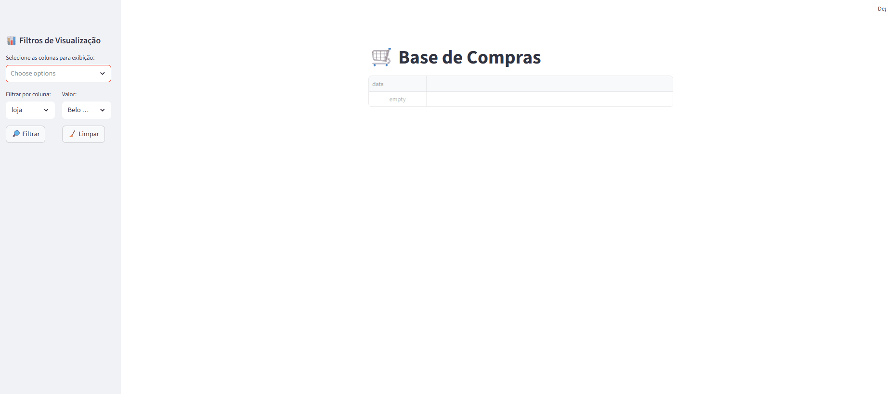
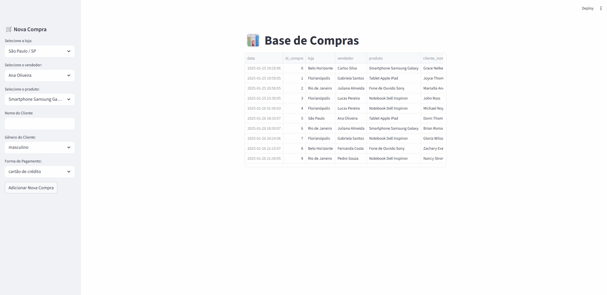
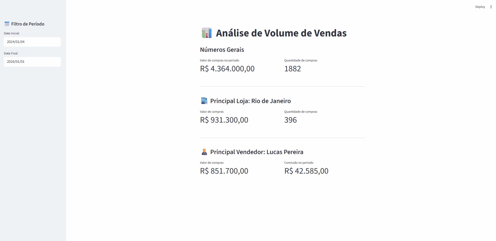
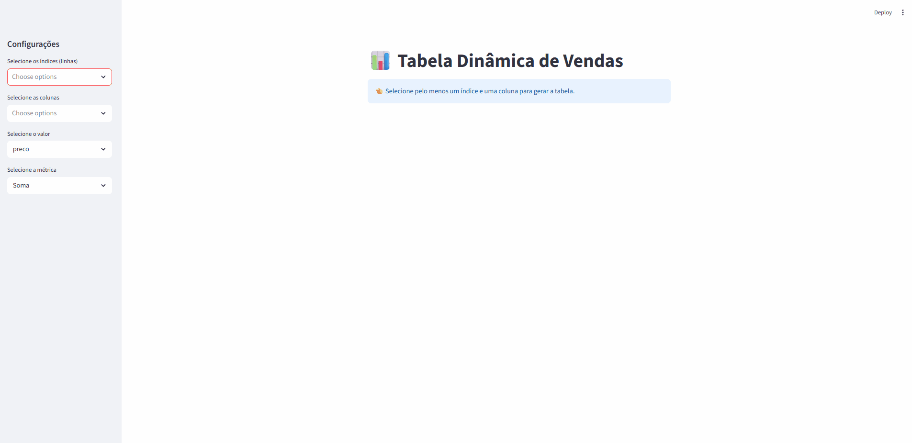
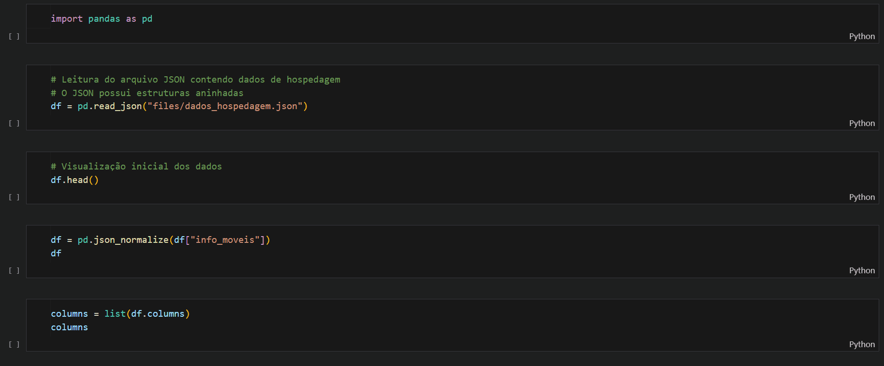
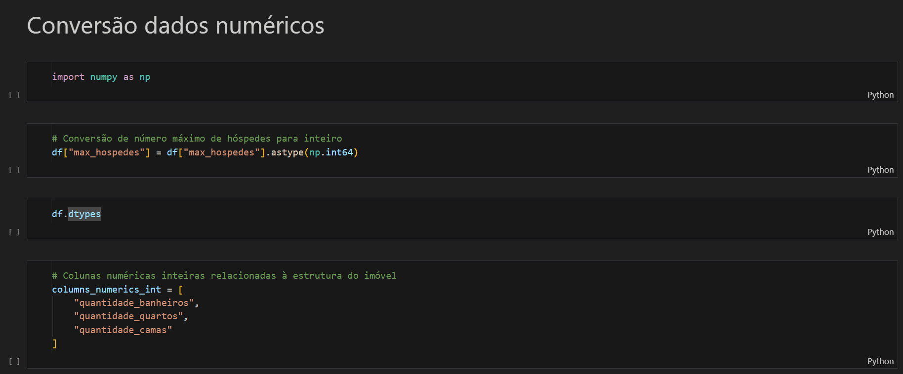
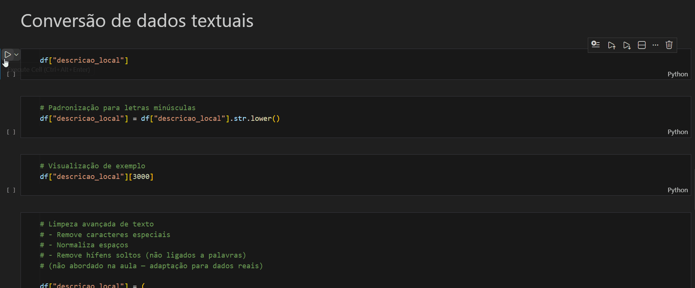
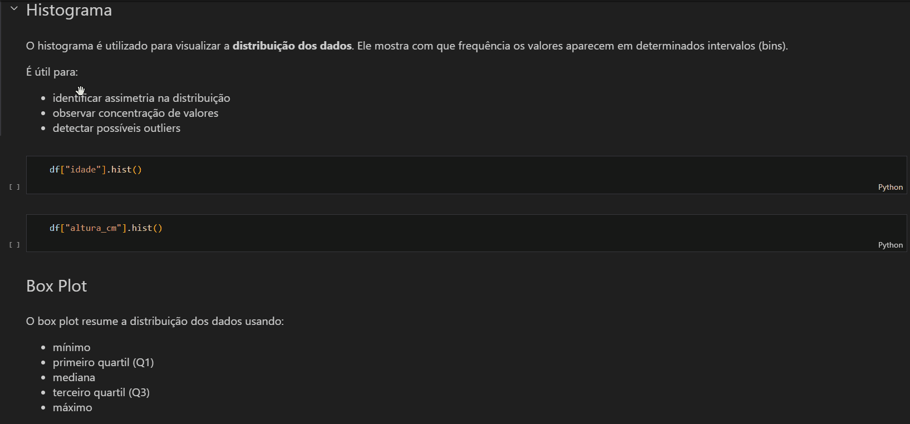

# 📊 Análise de Dados com Python & Pandas

Repositório dedicado ao meu **desenvolvimento prático e progressivo em Análise de Dados**, utilizando **Python, Pandas, visualização de dados, estatística aplicada, Streamlit e integração com bancos de dados**.

Este projeto faz parte da minha **transição e consolidação profissional como Analista de Dados**, com foco em **boas práticas, organização de código, análise exploratória e geração de insights**.

---

## 🎯 Objetivo do Repositório

- Consolidar fundamentos e práticas de **Análise de Dados com Python**
- Aplicar **Pandas** em cenários reais e progressivos
- Desenvolver **pensamento analítico e estatístico**
- Criar **dashboards e análises interativas**
- Demonstrar evolução técnica de forma clara e organizada
- Servir como **portfólio técnico** para oportunidades em Dados

---

## 🧠 Tecnologias e Ferramentas

- **Python**
- **Pandas**
- **NumPy**
- **Matplotlib / Seaborn / Plotly**
- **Streamlit**
- **SQL / SQLAlchemy**
- **Jupyter Notebook**
- **Git & GitHub**

---

## 📂 Estrutura do Repositório
````
analise-dados-python-pandas/
│
├─ seccao-1-pandas-hands-on/
├─ seccao-2-pandas-transformacao/
├─ seccao-3-estatistica-aplicada/
├─ seccao-4-analise-exploratoria/
├─ seccao-5-dataviz-fundamentos/
├─ seccao-6-streamlit-mini-projeto-3/
├─ seccao-7-integracao-banco-dados/
│
├─ .gitignore
├─ requirements.txt
└─ README.md
````

---

## ✅ Seção 1 — Pandas Hands-on (CONCLUÍDA)

Nesta seção, foram desenvolvidos **exercícios práticos e um mini projeto completo**, cobrindo desde os fundamentos até análises interativas com Streamlit.

### 🔹 Conteúdos abordados
- Series e DataFrames
- Leitura e escrita de CSV, Excel e JSON
- Análise e exploração de dados
- Filtros, seleções e agregações
- Integração entre múltiplas tabelas
- Métricas e indicadores
- Tabela dinâmica com Pandas
- Aplicações interativas com Streamlit

---

### 🧪 Mini Projeto – Aplicação Analítica com Streamlit

A Seção 1 culmina em um **mini projeto prático**, com geração de dados simulados e dashboards interativos.

#### Funcionalidades desenvolvidas:

##### 📄 1. Visualização da Base de Dados


##### 🎛️ 2. Seleção Dinâmica de Colunas e Filtros


##### ➕ 3. Adição de Novas Compras


##### 📈 4. Métricas e Volume de Dados


##### 📊 5. Tabela Dinâmica Interativa


---

## 🔄 Seção 2 — Pandas: Transformação de Dados (CONCLUÍDA)

Nesta seção o foco foi **limpeza, padronização e transformação de dados**, simulando problemas reais encontrados em bases de dados do dia a dia.

### 🔹 Conteúdos abordados
- Normalização de dados semi-estruturados (JSON)
- Conversão e padronização de dados numéricos
- Limpeza e tratamento de dados textuais
- Preparação de dados para análise e modelagem
- Boas práticas de pré-processamento com Pandas

---

### 🔧 Principais Transformações Desenvolvidas

#### 📦 Normalização de dados JSON
Transformação de estruturas aninhadas em colunas tabulares, facilitando análise e exploração.



---

#### 🔢 Conversão de dados numéricos
Tratamento de valores monetários armazenados como texto, remoção de símbolos e conversão para tipos numéricos adequados.



---

#### 🧹 Limpeza e padronização textual
Remoção de caracteres especiais, padronização de espaços e preparação de campos textuais para análise.



---

## 📐 Seção 3 — Estatística Aplicada (CONCLUÍDA)

Nesta seção foram abordados os **fundamentos estatísticos essenciais para análise de dados**, com foco na aplicação prática utilizando Pandas e visualizações básicas.

### 🔹 Conteúdos abordados
- Medidas de posição (média, mediana e moda)
- Medidas de dispersão (variância, desvio padrão e coeficiente de variação)
- Medidas de forma (assimetria e curtose)
- Correlação (Pearson e Spearman)
- Visualização estatística com gráficos básicos

### 📊 Demonstrações práticas

#### 🔗 Análise de Correlação


#### 📈 Distribuição dos Dados


---

### 🚧 Seção 4 Análise Exploratória de Dados (EDA) — Em andamento

A próxima seção está atualmente em desenvolvimento e dará continuidade ao aprofundamento em análise e manipulação de dados.

---

## 📚 Próximas Seções (Roadmap)

- 📊 **Visualização de Dados**
- 🌐 **Dashboards com Streamlit**
- 🗄️ **Integração com Bancos de Dados (SQL, PostgreSQL, MongoDB)**

---

## 🧩 Organização e Boas Práticas

- Código organizado por **seções temáticas**
- Commits semânticos e progressivos
- Separação clara entre dados, scripts e análises
- Uso de **Pathlib** para portabilidade
- Padronização de encoding (`utf-8`)
- Tratamento consistente de dados numéricos e textuais

---

## 🚀 Considerações Finais

Este repositório representa minha **evolução prática em Análise de Dados**, indo além de exemplos isolados e focando em **aplicação real, organização e clareza analítica**.

Ele será continuamente atualizado conforme avanço nos estudos e projetos.

---

📌 *Repositório em constante evolução — cada seção representa um novo nível de maturidade técnica.*
