# 📊 Análise de Dados com Python & Pandas

Repositório dedicado ao meu desenvolvimento prático e progressivo em **Análise de Dados**, aplicando Python em cenários estruturados que simulam desafios reais de negócio.

Este projeto representa minha consolidação prática em Análise de Dados, com foco em aplicação real, organização profissional e construção de soluções orientadas a métricas de negócio.

---

# 💼 Posicionamento Profissional

Este repositório demonstra minha capacidade de:

- ✔ Manipular e transformar grandes volumes de dados com Pandas
- ✔ Aplicar estatística para geração de insights
- ✔ Construir dashboards interativos com Streamlit
- ✔ Estruturar projetos de forma organizada e escalável
- ✔ Comunicar resultados de maneira clara e visual
- ✔ Publicar aplicações em ambiente de produção

> Objetivo: Atuar como **Analista de Dados Jr**, aplicando análise, visualização e pensamento analítico orientado a métricas de negócio.

---

# 🧠 Abordagem Técnica

Ao longo das seções, aplico:

- Análise exploratória de dados (EDA)
- Testes estatísticos (ex: Qui-Quadrado, Correlação)
- Transformação e limpeza de dados
- Construção de métricas estratégicas (KPIs)
- Visualização orientada à tomada de decisão
- Deploy de dashboards com Streamlit Cloud

---

## 🎯 Objetivo do Repositório

- Consolidar fundamentos e práticas de Análise de Dados
- Aplicar Pandas em cenários reais e progressivos
- Desenvolver pensamento analítico e estatístico
- Criar dashboards e análises interativas
- Demonstrar evolução técnica de forma clara
- Servir como portfólio técnico para oportunidades em Dados

---

## 🧠 Tecnologias e Ferramentas

- Python
- Pandas
- NumPy
- Matplotlib / Seaborn / Plotly
- Streamlit
- SQL / SQLAlchemy
- Jupyter Notebook
- Git & GitHub

---

## 📌 Destaques Técnicos do Projeto

✔ Estrutura modular organizada por domínio  
✔ Integração entre análise, banco de dados e aplicação  
✔ Deploy em ambiente real (Streamlit Cloud)  
✔ Implementação de autenticação simulada  
✔ Uso de ORM (SQLAlchemy)  
✔ CRUD completo em SQLite, PostgreSQL e MongoDB  
✔ Separação entre camada de persistência e interface  
✔ Commits semânticos e evolução progressiva  

---

## 📂 Estrutura do Repositório
````
analise-dados-python-pandas/
│
├─ seccao-1-pandas-hands-on/
├─ seccao-2-pandas-transformacao/
├─ seccao-3-estatistica-aplicada/
├─ seccao-4-analise-exploratoria/
├─ seccao-5-dataviz-fundamentos/
├─ seccao-6-streamlit-mini-projeto-3/
├─ seccao-7-integracao-banco-dados/
│
├─ .gitignore
├─ requirements.txt
└─ README.md
````

---

## ✅ Seção 1 — Pandas Hands-on (CONCLUÍDA)

Nesta seção, foram desenvolvidos **exercícios práticos e um mini projeto completo**, cobrindo desde os fundamentos até análises interativas com Streamlit.

### 🔹 Conteúdos abordados
- Series e DataFrames
- Leitura e escrita de CSV, Excel e JSON
- Análise e exploração de dados
- Filtros, seleções e agregações
- Integração entre múltiplas tabelas
- Métricas e indicadores
- Tabela dinâmica com Pandas
- Aplicações interativas com Streamlit

---

### 🧪 Mini Projeto – Aplicação Analítica com Streamlit

A Seção 1 culmina em um **mini projeto prático**, com geração de dados simulados e dashboards interativos.

#### Funcionalidades desenvolvidas:

##### 📄 1. Visualização da Base de Dados
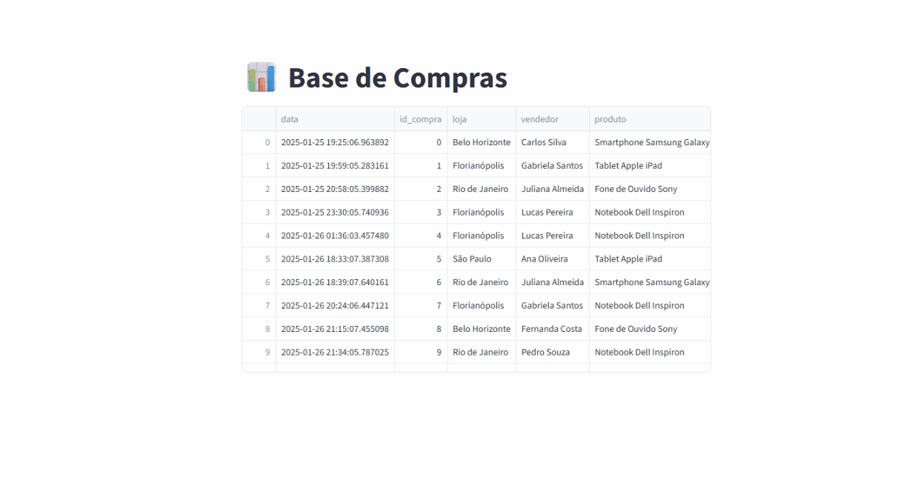

##### 🎛️ 2. Seleção Dinâmica de Colunas e Filtros
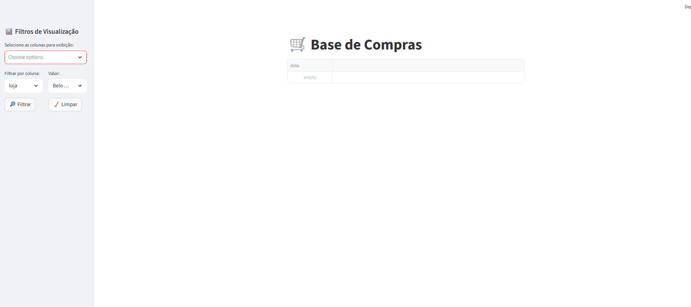

##### ➕ 3. Adição de Novas Compras
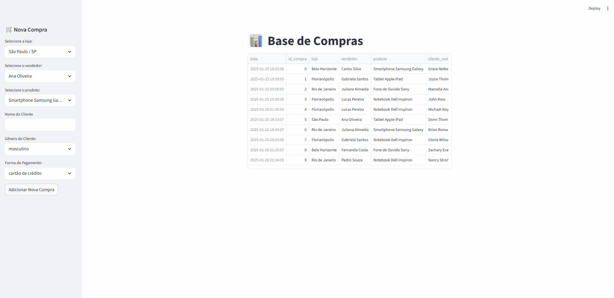

##### 📈 4. Métricas e Volume de Dados
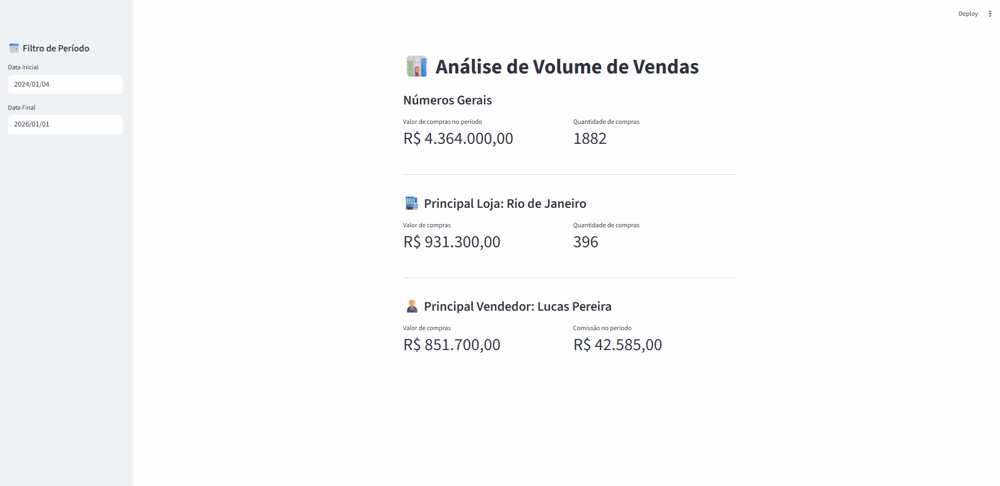

##### 📊 5. Tabela Dinâmica Interativa
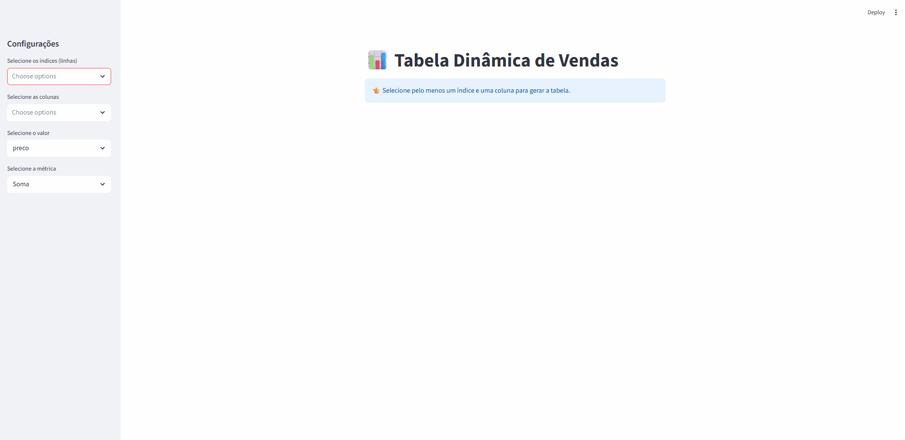

---

## 🔄 Seção 2 — Pandas: Transformação de Dados (CONCLUÍDA)

Nesta seção o foco foi **limpeza, padronização e transformação de dados**, simulando problemas reais encontrados em bases de dados do dia a dia.

### 🔹 Conteúdos abordados
- Normalização de dados semi-estruturados (JSON)
- Conversão e padronização de dados numéricos
- Limpeza e tratamento de dados textuais
- Preparação de dados para análise e modelagem
- Boas práticas de pré-processamento com Pandas

---

### 🔧 Principais Transformações Desenvolvidas

#### 📦 Normalização de dados JSON
Transformação de estruturas aninhadas em colunas tabulares, facilitando análise e exploração.

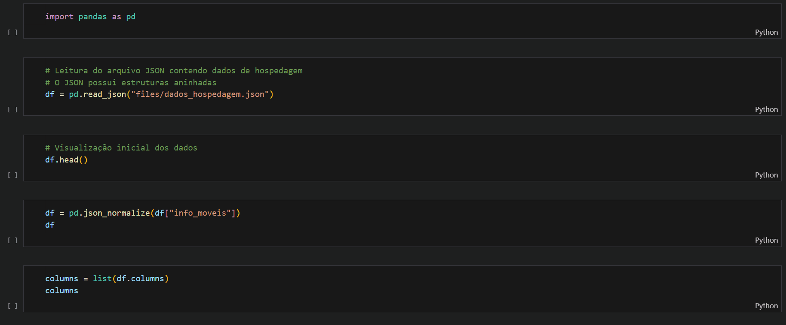

---

#### 🔢 Conversão de dados numéricos
Tratamento de valores monetários armazenados como texto, remoção de símbolos e conversão para tipos numéricos adequados.

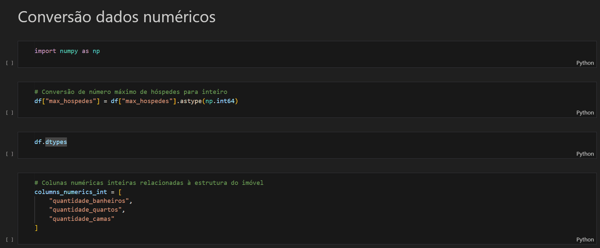

---

#### 🧹 Limpeza e padronização textual
Remoção de caracteres especiais, padronização de espaços e preparação de campos textuais para análise.

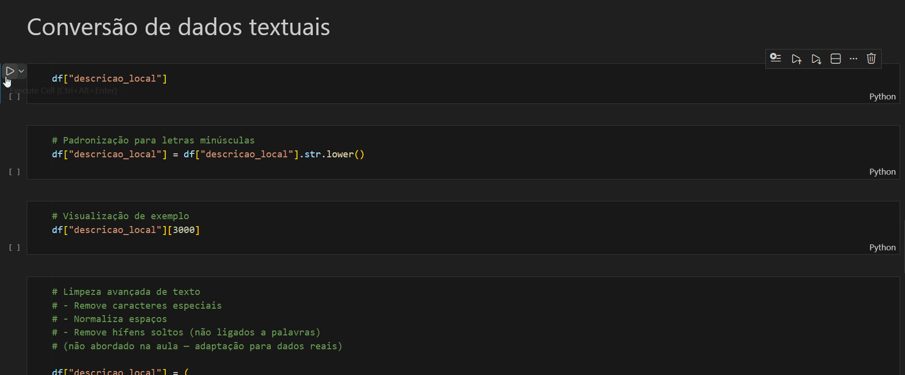

---

## 📐 Seção 3 — Estatística Aplicada (CONCLUÍDA)

Nesta seção foram abordados os **fundamentos estatísticos essenciais para análise de dados**, com foco na aplicação prática utilizando Pandas e visualizações básicas.

### 🔹 Conteúdos abordados
- Medidas de posição (média, mediana e moda)
- Medidas de dispersão (variância, desvio padrão e coeficiente de variação)
- Medidas de forma (assimetria e curtose)
- Correlação (Pearson e Spearman)
- Visualização estatística com gráficos básicos

### 📊 Demonstrações práticas

#### 🔗 Análise de Correlação
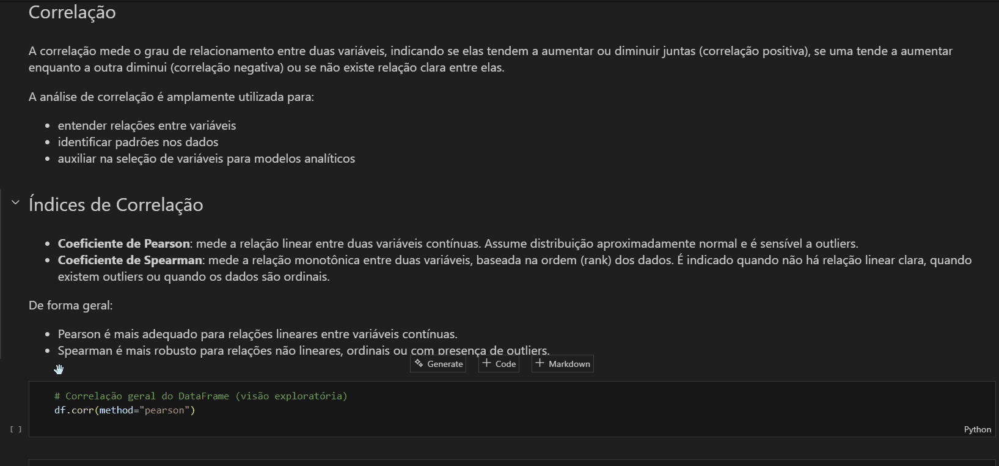

#### 📈 Distribuição dos Dados
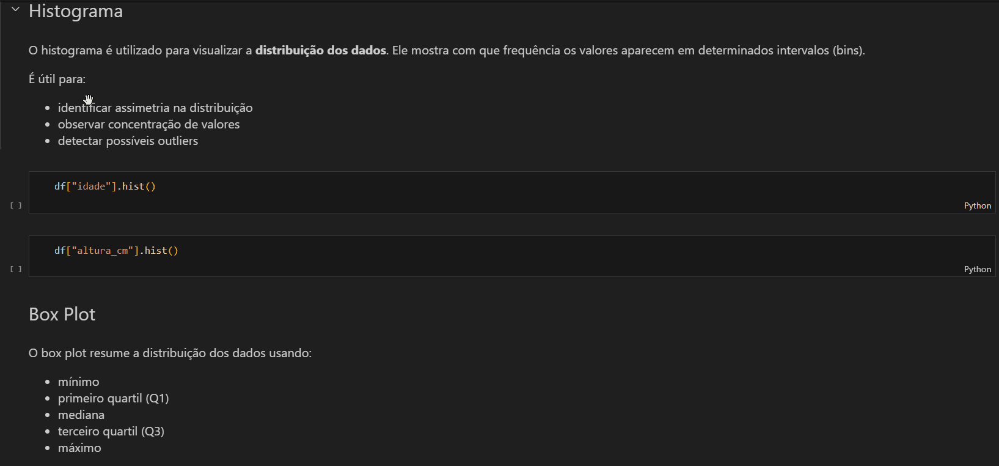

---

## 🔍 Seção 4 — Análise Exploratória dos Dados (EDA)

Nesta etapa, foi realizada uma análise exploratória com foco em compreender o
comportamento dos clientes, identificar padrões relacionados ao churn e preparar
os dados para análises futuras.

### 📊 Preparação e entendimento dos dados
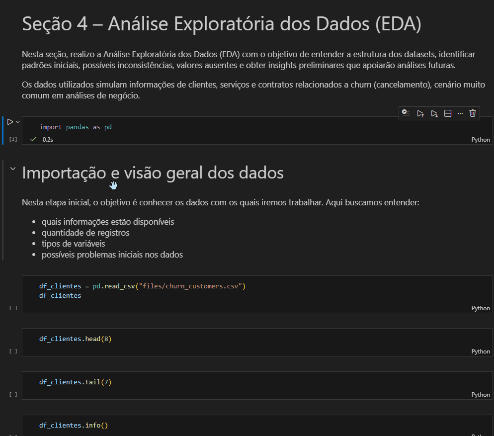

### 📉 Análise de churn e insights de negócio
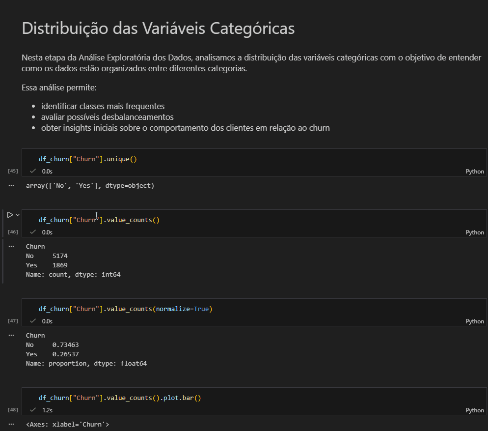

> Testes estatísticos (Qui-Quadrado) foram utilizados para validar a relação entre
tipo de contrato e churn, confirmando dependência entre as variáveis.

---

## 📊 Seção 5 — Visualização de Dados (CONCLUÍDA)

Nesta seção, o foco foi o **aprofundamento em visualização de dados**, explorando
diferentes bibliotecas e abordagens para comunicar insights de forma clara,
interativa e orientada ao negócio.

### 🔹 Conteúdos abordados
- Visualização estatística com **Seaborn**
- Gráficos interativos com **Plotly**
- Análise de relações entre variáveis (pairplot)
- Distribuição de dados por categoria (violinplot)
- Séries temporais interativas
- Visualização geográfica com **Folium**
- Integração com **datasets reais via URL (USGS)**

---

### 📈 Visualizações Estatísticas e Interativas

- **Pairplot** para análise de correlação entre variáveis numéricas  
- **Violinplot** para comparação de distribuições por categoria  
- **Gráficos interativos com Plotly**, explorando séries temporais e dispersão  

Essas visualizações permitem uma análise mais rica e exploratória,
facilitando a identificação de padrões e tendências.

### 📈 Visualizações Interativas com Plotly

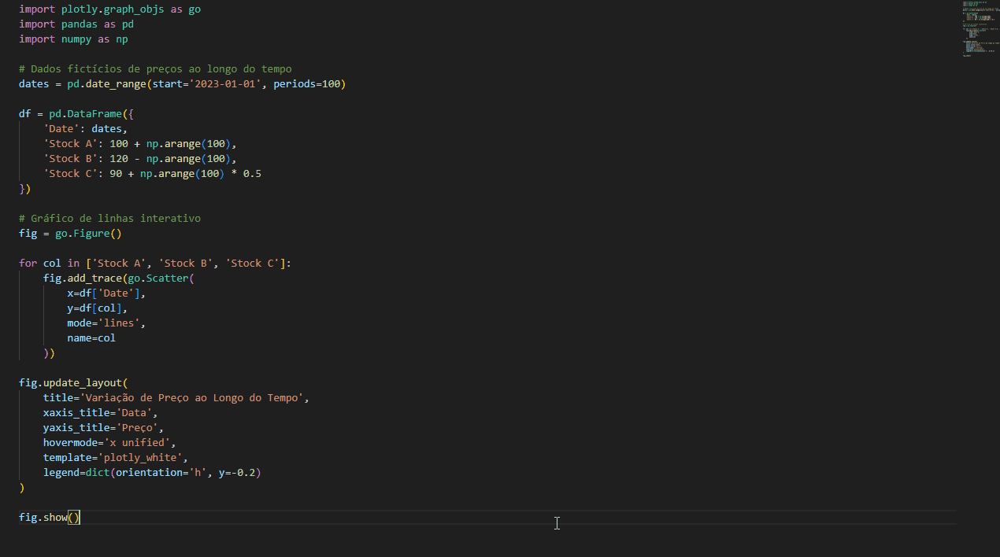

---

### 🌍 Visualização Geográfica — Mapas Interativos

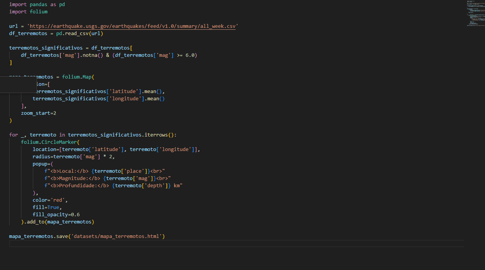

Como fechamento da seção, foi desenvolvido um **mapa interativo de terremotos**
utilizando **Folium**, consumindo dados reais da API pública do
**USGS (U.S. Geological Survey)**.

#### 🔎 Funcionalidades:
- Leitura direta de dataset CSV via URL
- Filtro de terremotos significativos (magnitude ≥ 6.0)
- Mapa interativo com marcadores georreferenciados
- Informações contextuais via popups
- Exportação do mapa em HTML

A próxima seção está atualmente em desenvolvimento e dará continuidade ao aprofundamento em análise e manipulação de dados.

---

# 🌐 Seção 6 — Dashboard Profissional com Streamlit (CONCLUÍDA)

Aqui está somente a Seção 6, revisada, organizada e pronta para copiar e colar no seu README:

🌐 Seção 6 — Dashboard Profissional com Streamlit (CONCLUÍDA)

Esta seção consolida a construção de um Dashboard completo de Análise de Vendas, integrando análise exploratória, métricas estratégicas, visualização interativa e deploy em ambiente de produção.

O projeto simula um cenário real de negócio, permitindo acompanhamento de desempenho e tomada de decisão orientada por dados.

---

## 🔐 Acesso ao Dashboard (Ambiente de Demonstração)

Para fins de demonstração, o dashboard conta com um sistema simples de autenticação, simulando um ambiente real de aplicação corporativa.

Você pode utilizar uma das credenciais abaixo:

### 👤 Usuário Administrador
- **Login:** `admin`
- **Senha:** `1234`

### 👤 Usuário Padrão
- **Login:** `bruno`
- **Senha:** `abcd`

> ⚠️ Observação:  
> Este sistema foi implementado para fins educacionais e de portfólio.  
> Em um ambiente de produção real, as credenciais seriam armazenadas de forma segura e criptografada.

## 🚀 Demonstração Online

🔗 Acesse o dashboard publicado:  
👉 **[CLIQUE AQUI PARA ACESSAR O DASHBOARD](https://bruno-dashboard-vendas.streamlit.app/)**

---

## 📊 Visão Geral do Projeto

O dashboard permite:

- 📈 Analisar receita mensal
- 📦 Visualizar volume de vendas
- 🧮 Monitorar KPIs estratégicos
- 🎛️ Aplicar filtros dinâmicos
- 📂 Explorar o dataset completo
- 📥 Exportar dados em Excel
- 🔐 Acesso com sistema de login
- 📱 Layout responsivo (Desktop e Mobile)

---

## 📈 Principais Aprendizados Técnicos

Durante o desenvolvimento desta aplicação, consolidei:

- Estruturação de projetos modulares em Python

- Separação entre lógica, visualização e estilização

- Manipulação eficiente de dados com Pandas

- Aplicação prática de estatística para geração de métricas

- Construção de KPIs orientados a negócio

- Uso de Pathlib para portabilidade

- Deploy em ambiente real (Streamlit Cloud)

- Organização de múltiplas páginas no Streamlit


---


## 🧠 Principais Funcionalidades

### 📌 1. KPIs Estratégicos

Indicadores calculados dinamicamente:

- Receita Total
- Lucro Total
- Quantidade de Pedidos
- Ticket Médio

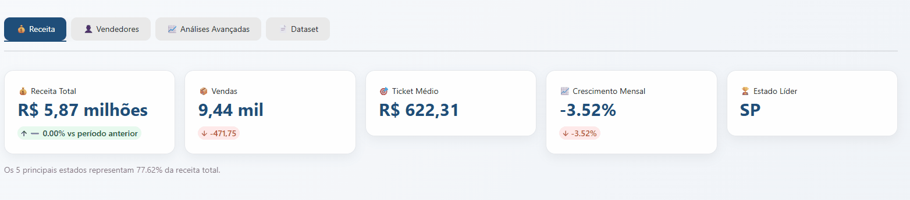

---

### 📈 2. Receita Mensal Interativa

Gráfico temporal construído com Plotly, permitindo:

- Visualização da evolução da receita
- Análise sazonal
- Interatividade e zoom

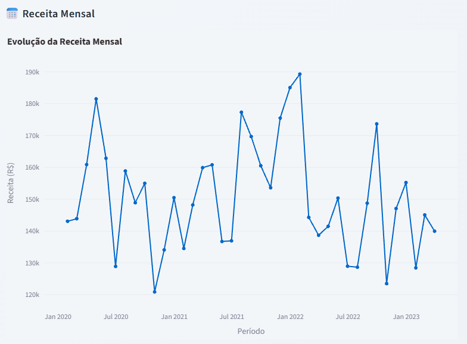

---

### 📊 3. Análise por Categoria / Região

Segmentação dos dados para identificação de padrões e oportunidades.

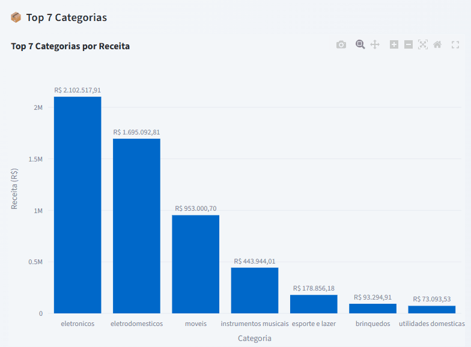

---

### 📄 4. Página de Dataset

- Visualização completa dos dados
- Filtros dinâmicos
- Exportação para Excel
- Estrutura organizada para exploração analítica

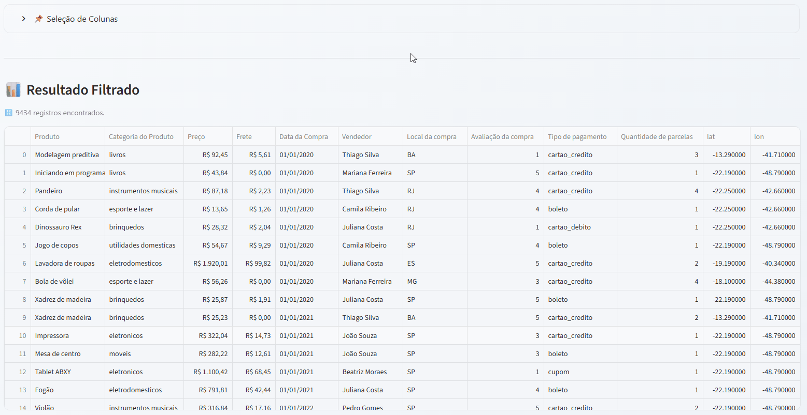

---

## 🛠️ Tecnologias Aplicadas

- Python
- Pandas
- Plotly
- Streamlit
- OpenPyXL
- CSS customizado
- Configuração via `.streamlit/config.toml`
- Organização modular com múltiplas páginas

---

## 🧩 Arquitetura do Projeto
````
seccao-6-dashboard-vendas/
│
├── app.py
├── utils.py
├── styles/
│ ├── global.css
│ ├── layout.css
│ ├── login.css
│ ├── metrics.css
│ ├── tabs.css
│
├── pages/
│ ├── 01_Dashboard.py
│ ├── 02_Dataset.py
│
└── .streamlit/
    └── config.toml
````

---

## 🎨 Diferenciais Técnicos

- ✔ Layout customizado com CSS externo
- ✔ Organização modular escalável
- ✔ Uso de Pathlib para portabilidade
- ✔ Separação entre lógica, visualização e estilo
- ✔ Estrutura preparada para expansão
- ✔ Deploy em produção
- ✔ Responsividade real

---

## 🎯 Objetivo da Seção

Consolidar:

- Construção de dashboards profissionais
- Integração entre análise e aplicação
- Boas práticas de organização de projeto
- Pensamento orientado a métricas de negócio

Esta seção marca a transição de análises isoladas para **aplicações analíticas completas e publicáveis**.

---

# 🗄️ Seção 7 – Persistência de Dados e Integração com Aplicações

Esta seção representa a transição da manipulação de dados em memória para a construção de uma camada estruturada de persistência, integrando bancos relacionais, NoSQL e aplicações reais.

O foco foi compreender, implementar e organizar operações completas de CRUD em diferentes tecnologias, aplicando boas práticas de arquitetura e separação de responsabilidades.

---

## 🔧 Tecnologias Utilizadas

- SQLite  
- PostgreSQL  
- MongoDB  
- SQLAlchemy (ORM)  
- Psycopg2  
- Streamlit  
- Tkinter  
- Python  

---

## 📌 Banco Relacional – SQLite

Implementação completa de CRUD com:

- Estrutura inicial de conexão
- Criação de tabela
- Inserção de dados
- Leitura estruturada
- Atualização de registros
- Exclusão de dados
- Refatoração para funções reutilizáveis
- Integração com formulário via Streamlit

**Objetivo:** consolidar fundamentos de modelagem relacional e persistência local.

---

## 🐘 PostgreSQL – Integração Profissional

Evolução da persistência para ambiente mais próximo de produção:

- Criação de função `get_connection` reutilizável
- Uso de `dotenv` para gerenciamento seguro de credenciais
- Inserção, leitura, atualização e exclusão de dados
- Retorno estruturado de consultas
- Separação clara entre camada de conexão e regras de negócio

**Objetivo:** simular cenário real de backend com banco relacional robusto.

---

## 🧩 ORM com SQLAlchemy

Implementação de camada de abstração com:

- Mapeamento objeto-relacional
- Manipulação de dados via modelos Python
- Operações CRUD utilizando ORM
- Comparação prática entre SQL puro e abstração via ORM

**Objetivo:** compreender quando utilizar SQL direto e quando utilizar abstração orientada a objetos.

---

## 📄 MongoDB – Banco NoSQL

Exploração de banco orientado a documentos com:

- Inserção de documentos (`insert_one`)
- Listagem com cursor (`find`)
- Atualização parcial com `$set`
- Exclusão com `delete_one`
- Manipulação de documentos estruturados
- Diferença prática entre schema fixo e flexível

**Objetivo:** entender cenários onde NoSQL é mais adequado que modelo relacional.

---

## 🖥️ Integração com Aplicações

A persistência foi conectada a aplicações reais:

### 🌐 Aplicação Web (Streamlit)
- Formulário para cadastro
- Listagem dinâmica de registros
- Integração direta com banco

### 🖥️ Aplicação Desktop (Tkinter)
- Interface gráfica para gerenciamento de dados
- Comunicação com camada de persistência

**Objetivo:** conectar backend de dados com interface de usuário, simulando arquitetura de aplicação real.

---

## 🧠 Conceitos Técnicos Consolidados

- Modelagem relacional  
- CRUD completo em múltiplos bancos  
- Diferença entre SQL e NoSQL  
- ORM vs SQL puro  
- Separação de responsabilidades  
- Organização modular de projeto  
- Persistência estruturada  
- Integração entre camada de aplicação e banco  

---

## 🎯 Evolução Técnica Representada Nesta Seção

Esta etapa marca a transição de análises isoladas para construção de sistemas com persistência estruturada, aproximando o projeto de um cenário real de backend e engenharia de dados.

A partir desta seção, o projeto evolui de análises isoladas para construção de sistemas com persistência estruturada, aproximando-se de um cenário real de backend e engenharia de dados.